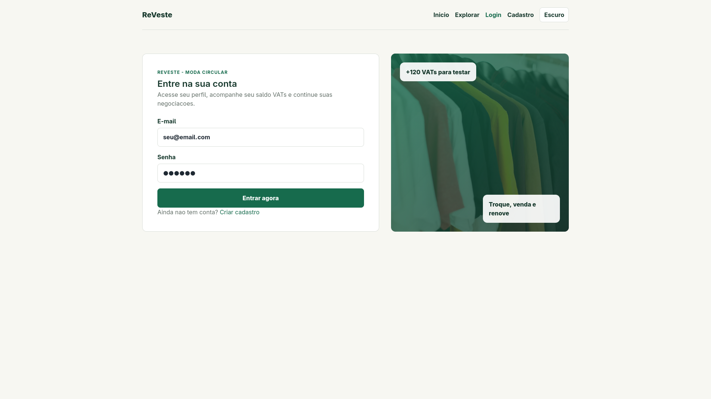
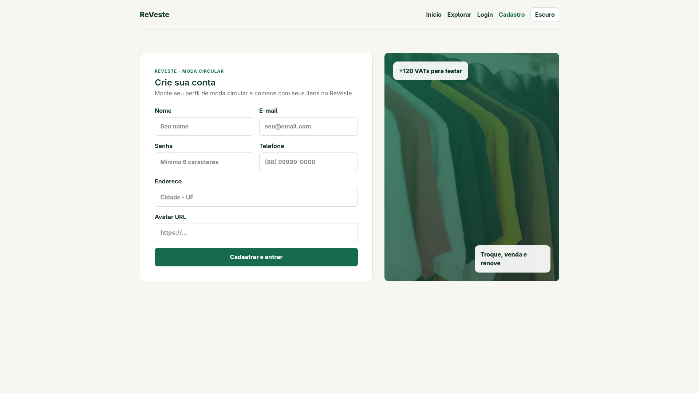
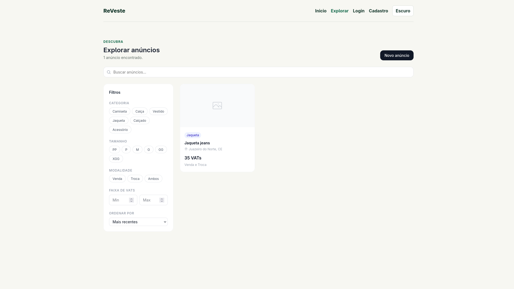
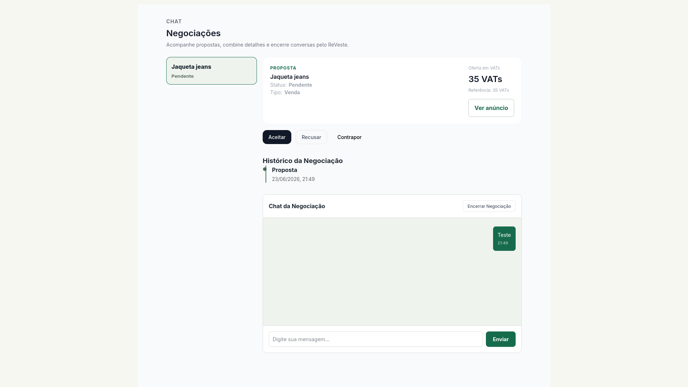
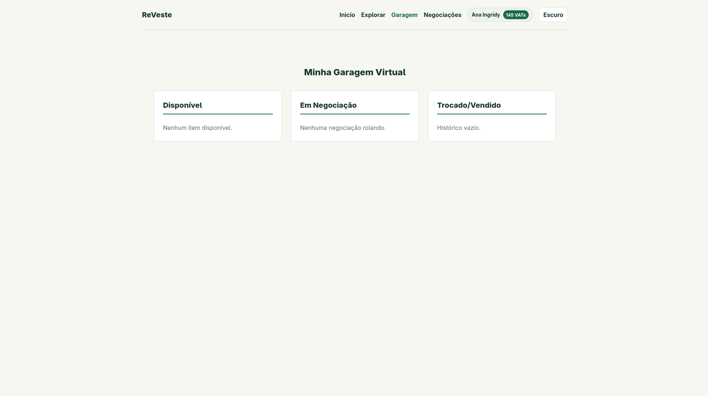
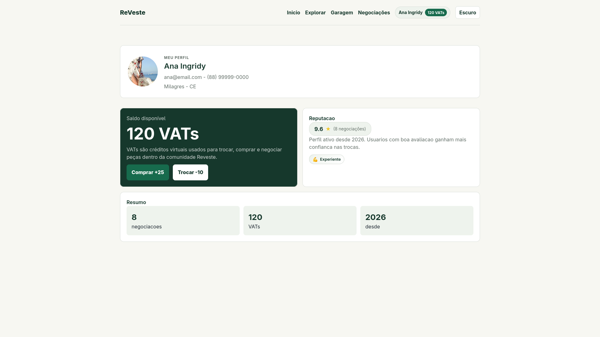

# ReVeste - Moda Circular

Projeto final da disciplina de Projetos de Sistema Web I - Semestre Letivo 2026.1, no curso Bacharelado em Sistemas de Informação, pelo IFCE Campus Crato.

O ReVeste é uma plataforma de brechó online desenvolvida utilizando React, voltada para compras, vendas e trocas de roupas usadas. 
O sistema permite que usuários anunciem peças e realizem negociações por meio de propostas utilizando uma moeda virtual chamada VATs para complementar trocas.

## Integrantes

- Ana Ingridy Belem
- Danillo Silva Alexandre Vaz
- Jhonatan Teixeira Lôbo
- Jônatas Silva Lima
- Pedro Yan da Silva Gois

## Instalação e Execução

1. Clone o repositório:
   ```
   git clone https://github.com/1-AkM-0/ReVeste.git
   ```
2. Na pasta `ReVeste`, instale as dependências:
   ```
   npm install
   ```
3. Execute o projeto:
   ```
   npm start
   ```

O sistema abrirá em `http://localhost:3000`. Para testar, crie um usuário como:
- **E-mail:** teste@email.com
- **Senha:** 123456

## Telas Principais

| Tela | Descrição |
|---|---|
|  | Tela de login com acesso ao usuário demo |
|  | Tela de cadastro de novo usuário |
|  | Página inicial com hero e estatísticas |
|  | Grid de anúncios com filtros |
|  | Chat e detalhes da negociação |
|  | Garagem virtual com 3 status |
|  | Perfil com saldo, reputação e selos |

## Funcionalidades Implementadas

### Obrigatórias
- Cadastro e login de usuários
- Criação, edição e exclusão de anúncios (foto, descrição, estado de conservação, modalidade, valor em VATs)
- Listagem pública de anúncios com filtros (categoria, tamanho, modalidade, faixa de VATs)
- Página de detalhe do anúncio com botão de negociação e validação de proposta
- Sistema de propostas: criar, aceitar, recusar e contrapropor (venda e troca)
- Chat com expiração de 7 dias
- Avaliação pós-negociação (ambas as partes avaliam)
- Perfil com reputação calculada dinamicamente
- Garagem virtual (disponível, negociando, concluído)
- Sugestão automática de VATs complementar (regra dos 20%)

### Opcionais 
- **Animações suaves**: fade-in de páginas, stagger em grids, hover lift em cards, modal com escala, skeleton shimmer
- **Selos de confiabilidade**: badges baseados em avaliação (Confiável, Super Confiável), total de negociações (Experiente, Veterano) e tempo de conta (Antigo no ReVeste)
- **Gráfico de evolução de VATs**: mini gráfico SVG inline no cartão de saldo, mostrando cada movimentação individual
- **Dark mode**: tema escuro com alternância via CSS variables
- **Sincronização garagem-proposta**: movimentações manuais na garagem refletem no status da proposta e vice-versa

## Dificuldades Encontradas e Soluções Adotadas

- **Sincronizar garagem com propostas**: quando uma proposta era aceita ou recusada, a garagem não refletia a mudança. A solução foi chamar `moverItemGaragem` e `sincronizarGaragemAnuncio` dentro dos handlers de `aceitar`, `recusar` e `encerrar`, além de integrar o hook `useGaragem` com `atualizarProposta` nas movimentações manuais.

- **Avaliação duplicada**: o componente Avaliacao aparecia duas vezes inline no card de negociação e em um modal sobreposto — após aceitar uma proposta. Removemos a versão inline e mantivemos apenas o modal, unificando o fluxo.

- **Gráfico sem dados imediatos**: a versão inicial agrupava registros por dia, exigindo dados de dias diferentes para exibir o gráfico. Mudamos para registrar movimentações individuais (`{id, amount, at}`), fazendo o gráfico aparecer imediatamente após a primeira compra ou troca.

- **Ambos os lados avaliarem**: inicialmente apenas o comprador avaliava. Corrigimos usando `getOutroParticipanteId`, que identifica dinamicamente quem é a outra parte da negociação, permitindo que vendedor também avalie.

---

### Principais Tecnologias

- React
- JavaScript
- LocalStorage
- CSS
